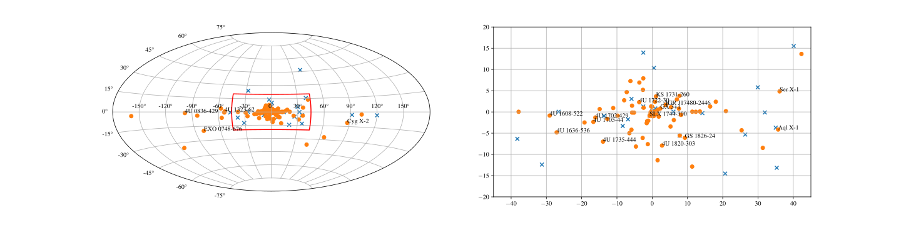

Welcome to the documentation for (Py)minbar!
============================================

This package provides tools and software for accessing,
analysing  and plotting data from the Multi-INstrument Burst ARchive (MINBAR)
that includes thermonuclear (X-ray) bursts observed by *RXTE*/PCA,
*BeppoSAX*/WFC and *INTEGRAL*/JEM-X; see `Galloway et al. 2020 (ApJS 349, 32) <https://iopscience.iop.org/article/10.3847/1538-4365/ab9f2e>`_ or the preprint at `arXiv:2003.00685 <https://arxiv.org/abs/2003.00685>`_

The required MINBAR ASCII data tables are available via the online data table repository at https://doi.org/10.26180/5e4a697d9b8b6

The code is written in Python 3, except for some legacy code related to
the burst lightcurve fitting (see folder burst_fit), in FORTRAN

.. toctree::
   :maxdepth: 2
   :caption: Contents:

   installation
   usage
   modules

Indices and tables
==================
* :ref:`genindex`
* :ref:`modindex`
* :ref:`search`
