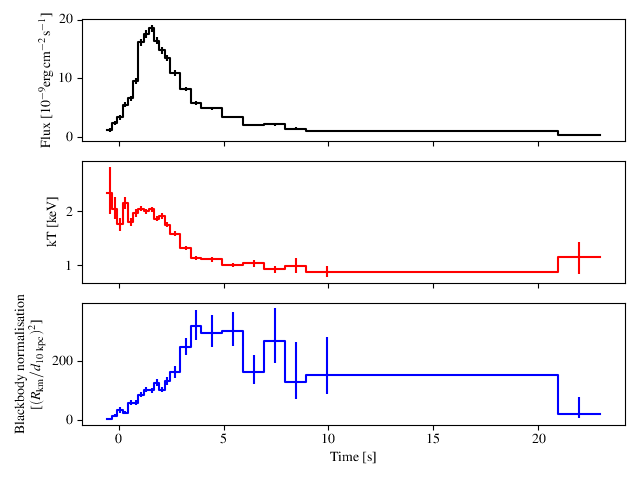
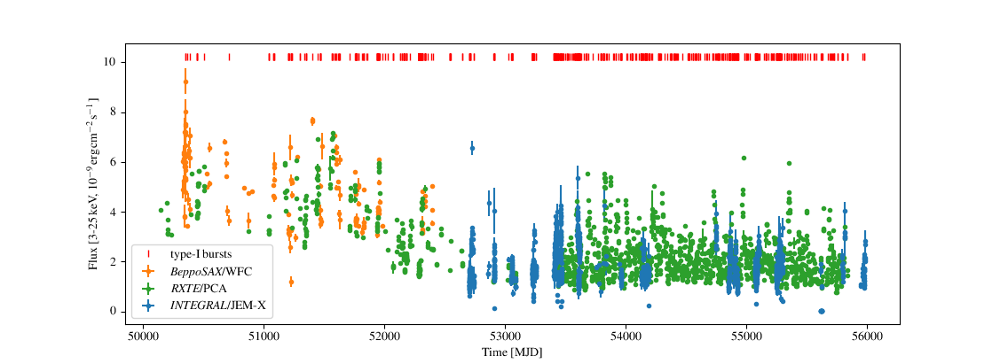

=====
Usage
=====

The base classes to access bursts, burst observations, and burst sources are :class:`minbar.Bursts`, :class:`minbar.Observations`, and :class:`minbar.Sources`, respectively. Creating instances of each one will read the data from the corresponding table file.

Here we provide basic usage; more examples are provided in the tutorial jupyter notebook

1. Working with bursts
----------------------

Here we initialise a :class:`minbar.Bursts` object, and select all the bursts from 4U 1636-536

.. code-block:: python

    import minbar
    mb = minbar.Bursts() # Load the burst database
    mb.name_like('1636') # Select a source using part of its name
    print (mb.field_labels.keys()) # See which fields are available
    mb.show() # List the selected bursts

The selection made with the :py:meth:`minbar.Minbar.name_like` and equivalent commands is *persistent*, and any subsequent query (e.g. extracting one of the table columns) will be restricted to the same set of events. You can reset to the full sample with :func:`minbar.Minbar.clear()`

Let's explore that below with some slightly more complex includes and excludes

.. code-block:: python

    mb.clear() # Reset the selection
    mb.select_all(['GS 1826-24', '4U 1636-536']) # Select multiple sources; requires exact names
    mb.clear() # Clear the selection so all sources are included
    mb.exclude_like('1636') # Exclude source from selection
    mb.exclude_like('1826') # Now two sources are excluded

Here's some analysis which involves working with the fluxes, and
estimating peak luminosity from the bolometric peak flux (table attribute
``bpflux``)

.. code-block:: python

    time = mb['time'] # Get a field as a numpy array (automatically time-ordered)
    id = mb[time > 54000.]['entry'] # extract ID #s for all the bursts after the specified time
    flux = mb['bpflux'] # Flux in 1e-9 erg/s/cm2
    sub = mb[['time','bpflux']] # extract a subset of the columns, for the given selection
    mb.create_distance_correction() # Include distance information from Sources()
    luminosity = (flux*mb['distcor']).to('erg s-1') # Isotropic peak luminosity in erg/s
    pca = mb.instr_like('pca') # Get index array for bursts observed with PCA
    pca_luminosity = luminosity[pca] # Luminosity of PCA bursts

A complete list of the :class:`minbar.Bursts` `table attributes <https://burst.sci.monash.edu/static/html/columns.html#bursts>`_, along with those for the :class:`Observations` and :class:`Sources` tables, can be found at the alternate web interface for the MINBAR data, `http://burst.sci.monash.edu <http://burst.sci.monash.edu>`_

Time-resolved spectroscopy for most of the *RXTE*/PCA and *BeppoSAX*/WFC bursts is available via the website, but can be downloaded using the :meth:`minbar.Bursts.get_burst_data` method. The :meth:`minbar.Bursts.burstplot` method can make nice plots of the downloaded data, or will just download the data on request as needed:

.. code-block:: python

    print (mb[2258]) # show the data table row for the 2nd burst from obsID 10088-01-07-02
    data = mb.get_burst_data(2258) # download the time-resolved spectroscopy table
    data.columns # show the available columns
    mb.burstplot(bdata=data) # plot those data, default is flux only
    mb.burstplot(2258, param=['flux','kT','rad']) # download and plot in one step, with extra parameters

The result of the last command is shown below; from top to bottom, bolometric burst flux, blackbody temperature, and radius. Use the ``show=False`` option to :meth:`minbar.Bursts.burstplot` to add your own annotation before calling ``plt.show()``.

2. Working with observations
----------------------------

As both the :class:`minbar.Bursts` and :class:`minbar.Observations`
classes are built on the underlying :class:`minbar.Minbar` class, many of
the methods are common to both classes. 

Below whe show an example of selecting all the observations from 4U
1636-536 and extracting the start times.

.. code-block:: python

    mo = minbar.Observations() # Load the observation database
    mo.name_like('1636') # Same source selection options as for burst database
    time = mo['tstart'] # And fields are accessed in the same way
    print (mo.field_labels.keys()) # See which fields are available

We can also plot the long-term history of the source using the plot
method, first selecting only the "good" observations (non-zero fluxes,
principally)

.. code-block:: python

    mo.good()
    mo.plot()

The result is below

3. Working with sources
----------------------------

The :class:`minbar.Sources` class is a little different as it is really just a wrapper for the underlying FITS table. Still, some of the methods as for the other two classes are available, including :meth:`minbar.Sources.name_like`.

Note that available :class:`minbar.Sources` methods do not include `select_all` or `exclude_like`

You can also select sources by type, e.g. ``C`` for ultracompact, or ``S``
for sources that have shown a superburst, or combinations of the two

.. code-block:: python

    ms = minbar.Sources() # Load the source database
    print (ms.field_labels.keys()) # Show available data fields
    ra = ms['ra_obj'] # Right ascension for all sources
    ms.name_like('1636') # Select a source using part of its name
    ra = ms['ra_obj'] # Right ascension for selected source only
    ms.clear() # Clear selection
    ms.type('SC') # Select all ultracompacts that have shown a superburst
    ms['name'] # ... and show their names

4. Analysing new X-ray observations
-----------------------------------

Below are some basic examples to analyse some (new?) X-ray data and search for bursts
(under development)

.. code-block:: python

    import minbar

    xte = minbar.Instrument('PCA') # Create an instrument definition
    obs = minbar.Observation(None, xte, '4U 1636-536', '10088-01-07-02')

    obs.plot()
    print (obs.mjd, obs.rate)

Can also define a new instrument for analysis of data from instruments not originally part of MINBAR

.. code-block:: python

    xmm = minbar.Instrument('XMM-Newton', 'xmm', 'XN', '2to7good.fits')
    obs = minbar.Observation(None, xmm, '1RXS J180408.9-342058', '0741620101')
    lc =obs.get_lc()

    import matplotlib.pyplot as plt
    plt.plot(lc['TIME'], lc['RATE'])
    plt.show()

And search for bursts

.. code-block:: python

    test = minbar.findburst(lc['TIME'], lc['RATE'], lc['ERROR'])
    print(test)
    [5.42058957e+08 5.42067368e+08 5.42075296e+08 5.42083081e+08
     5.42090903e+08]

These tools are currently under development
